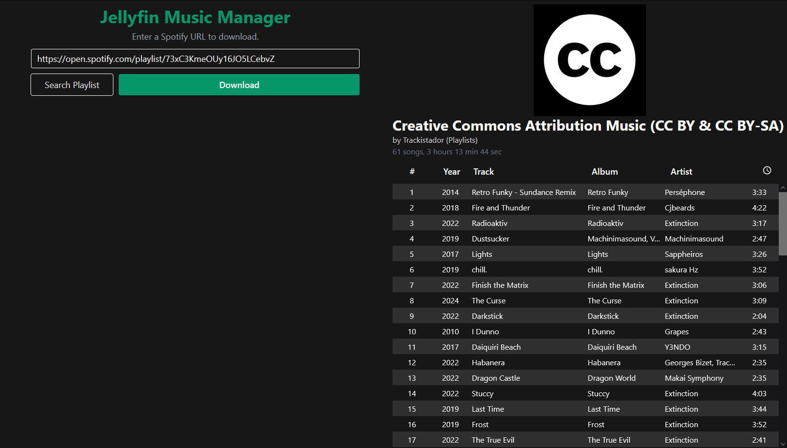

# Jellyfin Music Manager

Jellyfin Music Manager is a FastAPI web interface designed to download music from public sources using Spotify links. This project aims to simplify the process of acquiring music and managing your [Jellyfin](https://jellyfin.org/) music library.



## Features

- Download music using Spotify links (not from Spotify)
- Seamlessly integrate with your Jellyfin music library
- Simple and user-friendly web interface

## Prerequisites

- Docker installed on your machine
- [Spotify Developer credentials](https://github.com/search?q=spotify_client_secret&type=code) (Client ID and Client Secret)
- Know where your Jellyfin music folder is

## Installation and Usage

### Step 1: Set Environment Variables

Create a `.env` file with your Spotify credentials:

```env
SPOTIFY_ID=your_spotify_client_id
SPOTIFY_SECRET=your_spotify_client_secret
```

### Step 2: Run the Docker Container

Run the Docker container with the necessary environment variables and volume bindings:

```bash
docker run -d -p 8000:80 --env-file .env -v /path/to/your/jellyfin/music/folder:/app/music connorswislow/jellyfin-music-manager
```

Replace `/path/to/your/jellyfin/music/folder` with the actual path to your Jellyfin music folder.

### Step 3: Access the Web Interface

Open your web browser and navigate to `http://localhost:8000`. You should see the Jellyfin Music Manager web interface where you can start downloading music using Spotify links.

## Contributing

We welcome contributions! If you have suggestions for improvements or new features, please open an issue or submit a pull request.

## License

This project is licensed under the MIT License.

## Acknowledgements

- [FastAPI](https://fastapi.tiangolo.com/)
- [Docker](https://www.docker.com/)
- [Jellyfin](https://jellyfin.org/)